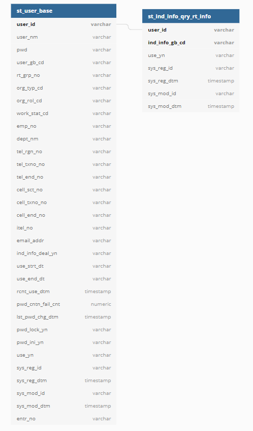

# webflux + r2dbc-demo
```java
./gradlew bootRun
```

## Swagger endpoint

http://localhost:8080/swagger-ui.html

## H2 Console

endpoint: http://localhost:8082

driver class : `org.h2.Driver`

JDBC URL: `jdbc:h2:mem:testdb`

user id : sa

~~password :~~

## Schema

